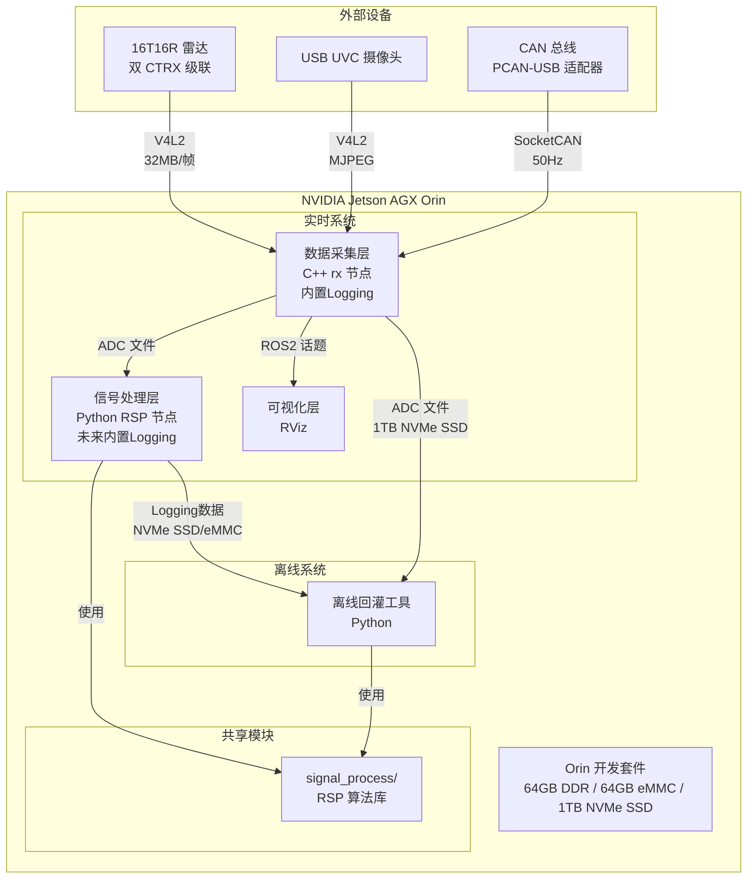
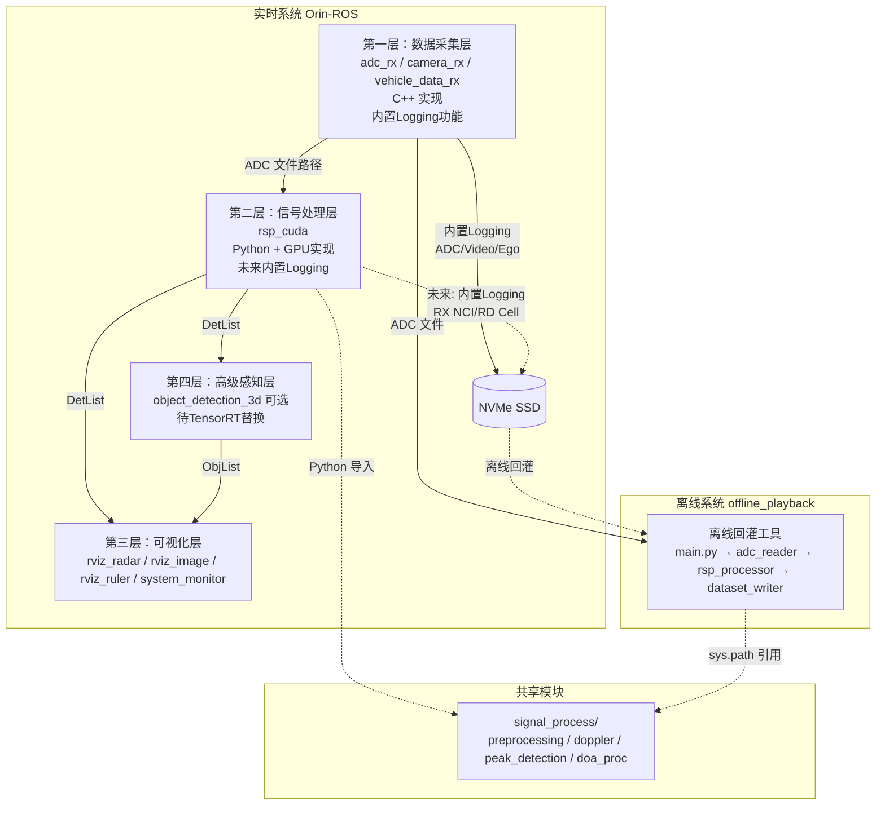
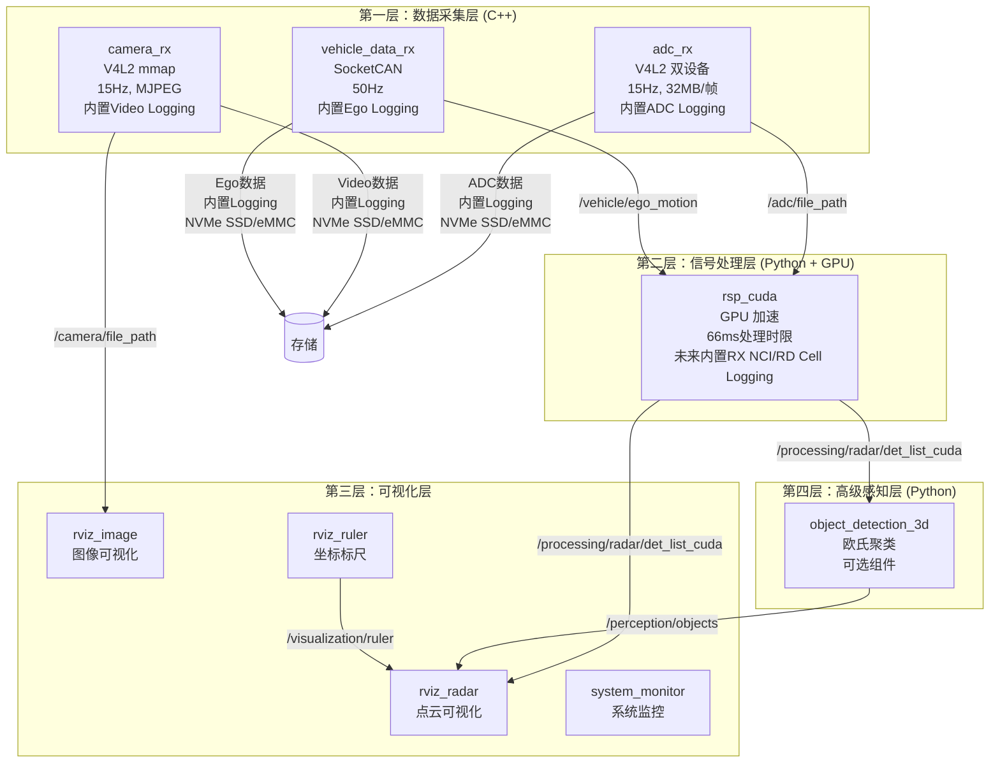
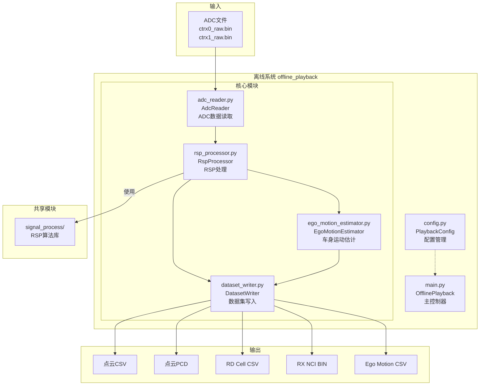
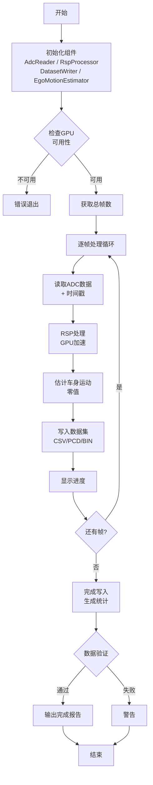

# Orin 雷达 SDK 软件架构文档 V2

**版本**: 2.0.0
**日期**: 2026-07-21
**作者**: zhengyuan.liu
**平台**: NVIDIA Jetson AGX Orin Development Kit

---

## 目录

- [1. 系统总体概述](#1-系统总体概述)
  - [1.1 系统背景与目标](#11-系统背景与目标)
  - [1.2 系统上下文图](#12-系统上下文图)
  - [1.3 技术栈概览](#13-技术栈概览)
  - [1.4 子系统概览](#14-子系统概览)
  - [1.5 高层架构图](#15-高层架构图)
  - [1.6 快速导航指南](#16-快速导航指南)
- [2. 实时系统（Orin-ROS）](#2-实时系统orin-ros)
  - [2.1 实时系统概述](#21-实时系统概述)
  - [2.2 实时系统架构图](#22-实时系统架构图)
  - [2.3 四层节点结构](#23-四层节点结构)
  - [2.4 Logging数采功能](#24-logging数采功能)
  - [2.5 RSP实时处理](#25-rsp实时处理)
  - [2.6 RVIZ可视化](#26-rviz可视化)
  - [2.7 CAN车身信息接收](#27-can车身信息接收)
  - [2.8 NVMe SSD存储扩展](#28-nvme-ssd存储扩展)
  - [2.9 运行模式管理](#29-运行模式管理)
  - [2.10 ROS2话题通信](#210-ros2话题通信)
- [3. 离线系统（offline_playback）](#3-离线系统offline_playback)
  - [3.1 离线系统概述](#31-离线系统概述)
  - [3.2 离线系统架构图](#32-离线系统架构图)
  - [3.3 模块结构](#33-模块结构)
  - [3.4 处理流程](#34-处理流程)
  - [3.5 输出数据格式](#35-输出数据格式)
- [4. 共享模块](#4-共享模块)
  - [4.1 共享模块概述](#41-共享模块概述)
- [5. 脚本工具集](#5-脚本工具集)
  - [5.1 脚本工具概述](#51-脚本工具概述)
  - [5.2 系统运维脚本](#52-系统运维脚本)
  - [5.3 数据分析脚本](#53-数据分析脚本)
  - [5.4 设备配置脚本](#54-设备配置脚本)
- [6. 系统间关系](#6-系统间关系)
  - [6.1 数据流转](#61-数据流转)
  - [6.2 数据格式兼容性](#62-数据格式兼容性)
  - [6.3 设计差异对比](#63-设计差异对比)
- [7. 附录](#7-附录)
  - [7.1 代码目录结构](#71-代码目录结构)
  - [7.2 ROS2话题总表](#72-ros2话题总表)
  - [7.3 消息定义汇总](#73-消息定义汇总)
  - [7.4 版本管理](#74-版本管理)

---

## 1. 系统总体概述

### 1.1 系统背景与目标

本软件是 16T16R 卫星雷达的域控端雷达 SDK 算法软件包，运行于 NVIDIA Jetson AGX Orin Development Kit 平台。系统实现毫米波雷达的数据采集、信号处理、目标检测和可视化功能，支持实时采集处理和离线数据回灌两种工作模式。

**核心目标**：
- 实现 16T16R 雷达的完整信号处理链路（预处理 → 多普勒处理 → 峰值搜索 → DOA 估计）
- 提供实时数据采集和处理能力（15 Hz 帧率，66ms处理时限）
- 支持多模式Logging数采功能（4种模式，无丢帧，微秒级时间同步）
- 支持离线算法验证和数据分析
- 确保多传感器时间同步精度（微秒级）
- 提供低CPU占用的RVIZ可视化

### 1.2 系统上下文图



**V2 架构变更说明**：
- **Logging功能内置化**：数据采集层（C++ rx节点）已将Logging功能直接内置在各自Rx Node中，不再使用独立的logging_node
- **信号处理层Logging**：目前尚未实现内置Logging，但后续将改造成内置方式
- **内置改造原因**：降低logging的数据传输消耗，提升ROS的稳定性

### 1.3 技术栈概览

| 类别 | 技术 | 说明 |
|------|------|------|
| **硬件平台** | NVIDIA Jetson AGX Orin | 64GB DDR, 64GB eMMC, 1TB NVMe SSD (PCIe 3.0) |
| **操作系统** | Ubuntu 20.04 | Linux 内核 5.10+, JetPack 5.1.2 (L4T R35.4.1) |
| **中间件** | ROS2 Foxy | 机器人操作系统，支持 DDS 通信 |
| **DDS 实现** | FastDDS | 共享内存传输，避免大消息分片 |
| **编程语言** | C++14/17 | 数据采集层（性能关键路径） |
| **编程语言** | Python 3.8 | 信号处理层、离线工具、可视化 |
| **GPU 加速** | PyTorch + CUDA | RSP 信号处理（rsp_cuda节点） |
| **视频接口** | V4L2 | 内核级视频设备访问 |
| **CAN 接口** | SocketCAN | Linux CAN 总线协议 |
| **可视化** | RViz2 | ROS2 标准可视化工具 |
| **存储** | NVMe SSD + eMMC | NVMe SSD为主存储，eMMC为备选 |

### 1.4 子系统概览

系统包含两大子系统：

**实时系统（Orin-ROS）**：
- 基于 ROS2 的实时数据采集和处理框架
- 四层节点结构：数据采集层 → 信号处理层 → 可视化层 → 高级感知层
- 从硬件传感器（雷达、相机、CAN）实时采集数据
- 执行完整的 RSP 信号处理链路（66ms内完成）
- 支持4种Logging模式（ADC Mode、RD Cell List Mode、Det List Mode、Idle Mode）
- Logging功能内置在数据采集层，信号处理层未来将实现内置Logging
- 输出 ROS2 话题供可视化和下游使用
- 适用场景：生产部署、实时测试、硬件验证、数据采集

**离线系统（offline_playback）**：
- 离线数据回灌工具
- 读取实时系统采集的 ADC 原始数据文件
- 逐帧执行 RSP 信号处理
- 生成标准格式数据集（CSV、PCD、BIN）
- 适用场景：算法验证、数据分析、结果复现

### 1.5 高层架构图



**V2 架构变更说明**：
- **第三层简化**：由于Logging功能内置到第一层和第二层，第三层现在仅负责可视化，不再包含logging_node
- **rviz_ruler位置**：从第四层移动到第三层（可视化层）

### 1.6 快速导航指南

| 角色 | 推荐阅读章节 | 预计时间 |
|------|-------------|---------|
| **新开发者** | 1.1-1.5（系统全貌）→ 7.1（代码目录） | 30 分钟 |
| **实时系统开发者** | 2.1-2.10（实时系统完整）→ 7.2（话题总表） | 45 分钟 |
| **离线系统开发者** | 3.1-3.5（离线系统完整）→ 4.1（共享模块） | 25 分钟 |
| **架构师/技术负责人** | 1.1-1.5 → 4.1 → 6.1-6.3（系统关系）→ 7.4（版本管理） | 40 分钟 |
| **测试工程师** | 2.4（Logging功能）→ 2.5（RSP性能）→ 2.9（运行模式） | 30 分钟 |
| **运维工程师** | 5.1-5.4（脚本工具集） | 20 分钟 |

---

## 2. 实时系统（Orin-ROS）

### 2.1 实时系统概述

实时系统是基于 ROS2 Foxy 的雷达数据采集和处理框架，采用四层节点结构，实现从传感器数据采集到高级感知的完整处理链路。系统运行于 NVIDIA Jetson AGX Orin，支持 15 Hz 实时处理。

**设计目标**：
- 硬件级时间戳同步（微秒精度）
- 高性能数据采集（32MB/帧 ADC 数据）
- 低延迟信号处理（66ms处理时限）
- 多模式Logging数采（4种模式，无丢帧）
- 可靠的 ROS2 话题通信
- 低CPU占用的可视化

**V2 架构改进**：
- **Logging内置化**：数据采集层的Logging功能已内置到各Rx Node中，降低数据传输开销
- **架构简化**：第三层仅负责可视化，职责更清晰

### 2.2 实时系统架构图



**V2 架构变更说明**：
- **rviz_ruler位置调整**：从第四层（高级感知层）移动到第三层（可视化层），因为它本质上是可视化工具而非感知算法
- **Logging内置**：第一层各节点内置Logging功能，不再依赖独立的logging_node
- **第三层简化**：仅包含可视化相关节点

### 2.3 四层节点结构

#### 2.3.1 数据采集层（C++ rx 节点）

**职责**：从硬件传感器采集原始数据，同步写入文件系统，发布文件路径消息，**内置Logging功能**

| 节点 | 输入 | 输出 | 频率 | 关键技术 |
|------|------|------|------|---------|
| **adc_rx** | V4L2 双 CTRX 级联 | `/adc/file_path` | 15 Hz | V4L2 mmap、硬件时间戳、文件路径发布、**内置ADC Logging** |
| **camera_rx** | V4L2 USB UVC 摄像头 | `/camera/file_path` | 15 Hz | Raw V4L2 mmap、硬件帧率控制、**内置Video Logging** |
| **vehicle_data_rx** | SocketCAN (PCAN-USB) | `/vehicle/ego_motion` | 50 Hz | SIOCGSTAMP 硬件时间戳、5 报文解析、**内置Ego Logging** |

**adc_rx 节点**：
- 采集双 CTRX 级联的 ADC 原始数据（32MB/帧）
- 使用 V4L2 mmap 零拷贝技术
- 同步写入 NVMe SSD（或eMMC）文件后发布文件路径
- **内置Logging**：直接在节点内完成ADC数据写入，无需额外ROS话题传输
- DDS 带宽从 480MB/s 降至 KB/s（降低 99.99%）
- CPU Loading < 5%

**camera_rx 节点**：
- 采集 USB UVC 摄像头图像
- 使用 Raw V4L2 mmap，消除 OpenCV 编解码开销
- VIDIOC_S_PARM 硬件帧率控制
- 降采样到320x240（QVGA）后写入存储
- **内置Logging**：直接在节点内完成Video数据写入
- CPU Loading < 5%

**vehicle_data_rx 节点**：
- 通过 SocketCAN 读取 CAN 总线数据
- 解析 FT测试车通信矩阵定义的5个报文：车速、档位、横摆角速度、纵/横向加速度、转向角
- Motorola 字节序信号提取
- 每20ms更新一次Ego数据buffer
- **内置Logging**：直接在节点内完成Ego数据CSV写入
- 支持 CSV 回退模式（CAN 未接入时）

**V2 架构改进 - Logging内置化**：
- **原架构**：各Rx Node通过ROS话题发布数据 → 独立logging_node订阅并写入存储
- **新架构**：各Rx Node直接在进程内完成数据写入存储
- **优势**：
  - 减少ROS话题传输开销（32MB ADC数据无需通过DDS）
  - 降低系统复杂度（减少一个独立节点）
  - 提升稳定性（减少节点间通信依赖）
  - 降低延迟（数据直接写入，无需等待话题订阅）

#### 2.3.2 信号处理层（Python RSP 节点）

**职责**：雷达信号处理（RSP），从 DDR 队列获取ADC数据，输出检测结果

| 节点 | 输入 | 输出 | 处理时限 | 实现 |
|------|------|------|---------|------|
| **rsp_cuda** | DDR队列 + `/vehicle/ego_motion` | `/processing/radar/det_list_cuda` | 66ms | GPU (PyTorch CUDA) |

**处理链路**：
1. 从DDR队列读取 ADC 数据（零拷贝）
2. 预处理（距离 FFT、窗函数）
3. 多普勒处理
4. 峰值搜索（CFAR）
5. DOA 估计（波束形成）

**性能要求**：
- 处理时限：66ms（15Hz实时处理）
- CPU Loading < 10%
- GPU利用率：50%-80%
- 可通过限制远距离处理保证66ms时限

**DDR队列机制**：
- ADC输入从DDR直接获取，不通过DDS传输
- DDR上设置队列增加鲁棒性
- 队列深度可配置，避免数据丢失
- 队列满时丢弃最旧数据

**共享模块**：使用 `signal_process/` 目录下的 RSP 算法实现

**V2 架构规划 - 未来Logging内置**：
- **当前状态**：rsp_cuda节点尚未内置Logging功能
- **未来规划**：将RX NCI和RD Cell List的Logging功能内置到rsp_cuda节点中
- **预期优势**：与数据采集层相同，减少ROS话题传输开销，提升稳定性

#### 2.3.3 可视化层

**职责**：数据可视化、系统监控

| 节点 | 功能 | 输入 | 输出 |
|------|------|------|------|
| **rviz_radar** | 雷达点云可视化 | DetList + ObjList + Ruler | PointCloud2 + MarkerArray |
| **rviz_image** | 相机图像可视化 | `/camera/file_path` | Image（叠加帧号和时间戳） |
| **rviz_ruler** | 坐标标尺 | — | `/visualization/ruler` (MarkerArray) |
| **system_monitor** | 系统监控 | 系统状态 | SystemMonitor + JSON 报告 |

**V2 架构变更**：
- **移除logging_node**：Logging功能已内置到数据采集层，第三层不再包含独立的logging_node
- **rviz_ruler位置调整**：从第四层移动到第三层，因为它本质上是可视化工具
- **第三层职责简化**：现在仅负责可视化和系统监控，职责更清晰

**rviz_radar**：
- 将DetList转换为PointCloud2
- 将ObjList转换为MarkerArray（3D目标框）
- CPU Loading < 5%

**rviz_image**：
- 读取JPEG文件（320x240）
- 可选叠加时间戳和帧ID
- CPU Loading < 3%

**rviz_ruler**：
- 生成坐标标尺，用于距离和角度参考
- 输出距离圆环（10m, 20m, 50m, 100m）和角度线
- CPU Loading < 1%

**system_monitor 监控指标**：
- 磁盘 I/O（读写速率、利用率）
- 内存占用
- 进程状态（CPU%、内存%）
- 时钟漂移（ROS Time vs System Time）
- 帧周期（ADC/Camera 帧间隔、抖动、丢帧）

#### 2.3.4 高级感知层

**职责**：3D 目标检测

| 节点 | 功能 | 输入 | 输出 | 状态 |
|------|------|------|------|------|
| **object_detection_3d** | 3D 目标检测 | `/processing/radar/det_list_cuda` | `/perception/objects` (ObjList) | 可选，待TensorRT替换 |

**object_detection_3d**：
- 当前使用欧氏聚类算法（模拟AI）
- 输出 14 字段 3D 目标（位置、速度、尺寸、朝向等）
- **标注为可选组件**，未来替换为 TensorRT AI 推理
- 可通过配置参数启用/禁用

**V2 架构变更**：
- **移除rviz_ruler**：已移动到第三层（可视化层）

### 2.4 Logging数采功能

#### 2.4.1 Logging模式概述

系统支持四种Logging模式，每种模式采集不同的数据组合：

| 模式 | ADC | RX NCI | RD Cell List | Det List | Obj List | Ego | Video |
|------|-----|--------|--------------|----------|----------|-----|-------|
| **ADC Mode** | ✓ | ✗ | ✗ | ✓ | ✓ | ✓ | ✓ |
| **RD Cell List Mode** | ✗ | ✓ | ✓ | ✓ | ✓ | ✓ | ✓ |
| **Det List Mode** | ✗ | ✗ | ✗ | ✓ | ✓ | ✓ | ✓ |
| **Idle Mode** | ✗ | ✗ | ✗ | ✗ | ✗ | ✗ | ✗ |

**模式切换**：
- 通过ROS参数 `logging_mode` 配置
- 模式切换仅在系统启动时生效
- Idle Mode时所有数据源禁用

#### 2.4.2 ADC Logging

**触发条件**：仅在 ADC Mode 时启用

**实现位置**：ADC Rx Node 进程（**内置**）

**数据流**：
```
ADC MIPI → DDR → NVMe SSD (或 eMMC)
         ↓
    timestamp (global)
```

**关键特性**：
- **V2改进**：Logging功能内置在adc_rx节点中，不再通过ROS话题传输
- 将ADC数据从DDR直接写入存储，避免多余数据copy
- 进程CPU Loading < 5%
- 单帧bin文件写入时间 < 10ms
- timestamp使用global timestamp，打在ADC MIPI接收完成时刻
- 数据格式：20字节头 + 32MB原始数据

**存储策略**：
- 加装NVMe SSD：写入 `/mnt/nvme/adc_data/{timestamp}.bin`
- 无NVMe SSD：写入eMMC，自动限制最大帧数

#### 2.4.3 RX NCI & RD Cell List Logging

**触发条件**：仅在 RD Cell List Mode 时启用

**实现位置**：RSP Node 进程（**当前通过ROS话题，未来将内置**）

**V2 架构状态**：
- **当前实现**：通过ROS话题 `/processing/radar/rx_nci` 和 `/processing/radar/rd_cell_list` 传输到logging_node
- **未来规划**：将Logging功能内置到rsp_cuda节点中，直接在进程内写入存储
- **改造原因**：降低ROS话题传输开销（2MB/帧 RX NCI数据），提升系统稳定性

**数据流（当前）**：
```
RSP处理 → RX NCI (2MB/帧) → ROS话题 → logging_node → NVMe SSD (或 eMMC)
        → RD Cell List     → ROS话题 → logging_node → NVMe SSD (或 eMMC)
```

**数据流（未来）**：
```
RSP处理 → RX NCI (2MB/帧) → NVMe SSD (或 eMMC)
        → RD Cell List     → NVMe SSD (或 eMMC)
```

**关键特性**：
- 进程CPU Loading < 5%
- 单帧数据文件写入时间 < 20ms
- timestamp沿用ADC的timestamp（保证同步）
- RX NCI格式：float32矩阵，形状(512, 1025)，大小2MB
- RD Cell List格式：CSV文件

#### 2.4.4 Video Logging

**触发条件**：在所有Logging模式下启用（除Idle Mode）

**实现位置**：Camera Rx Node 进程（**内置**）

**数据流**：
```
Camera V4L2 → 降采样(320x240) → NVMe SSD (或 eMMC)
                              ↓
                         timestamp (global)
```

**V2 架构改进**：
- **移除JPEG编码**：camera_rx节点去掉了JPEG编码和解码，直接写入原始数据
- **Logging内置**：直接在camera_rx节点内完成Video数据写入

**关键特性**：
- 使用320x240（QVGA）分辨率，平衡CPU开销和图像质量
- 进程CPU Loading < 5%
- 单帧图片写入时间 < 5ms
- timestamp使用global timestamp，打在图片接收完成时刻

#### 2.4.5 Ego Logging

**触发条件**：在所有Logging模式下启用（除Idle Mode）

**实现位置**：Vehicle Data Rx Node 进程（**内置**）

**数据流**：
```
CAN报文 → 解析 → Ego Buffer → CSV文件 (每20ms)
                              ↓
                         timestamp (global)
```

**关键特性**：
- **V2改进**：Logging功能内置在vehicle_data_rx节点中
- 接收多个CAN报文更新Ego数据buffer
- 每20ms将最新Ego Buffer写入csv文件
- 写入时间 < 1ms
- timestamp使用global timestamp，打在每20ms发布时刻
- CSV格式：`timestamp_us,vx,yaw_rate,steering_angle,ax,ay,gear`

#### 2.4.6 时间戳同步机制

**全局时间戳系统**：
- 统一的微秒级时间戳（uint64）
- 时钟源：CLOCK_MONOTONIC（硬件时间戳）
- 所有数据源使用同一时间基准

**时间戳来源**：
- ADC：V4L2 `v4l2_buffer.timestamp`（MIPI接收完成时刻）
- Camera：V4L2 `v4l2_buffer.timestamp`（图片接收完成时刻）
- Ego：SocketCAN `SIOCGSTAMP` ioctl（CAN帧到达时刻）
- RSP输出：沿用ADC的timestamp

**同步精度**：
- 时间戳误差 < 10us
- 所有数据timestamp在同一时间区间内
- 无时钟偏移（同源CLOCK_MONOTONIC）

#### 2.4.7 磁盘空间管理

**存储检测**：
- 系统启动时检测NVMe SSD是否存在
- 存在：使用NVMe SSD作为主存储
- 不存在：使用eMMC，自动计算最大帧数

**最大帧数计算**（eMMC模式）：
```python
# 预留10%安全空间
available_space = disk_free_space * 0.9

# 计算单帧数据大小
frame_size = adc_size + video_size + ego_size + det_list_size
# ADC Mode: 32MB + 50KB + 100B + 10KB ≈ 32MB
# RD Cell List Mode: 2MB + 50KB + 100B + 10KB ≈ 2MB

# 计算最大帧数
max_frames = available_space / frame_size
```

**优雅停止**：
- 达到max_frames时自动停止logging
- 发布停止信号到 `/system/stop_all`
- 确保所有文件正确关闭
- 输出录制统计报告

#### 2.4.8 性能要求总结

| 数据类型 | CPU Loading | 写入时间 | 频率 | 存储位置 | 实现方式 |
|---------|-------------|---------|------|---------|---------|
| ADC | < 5% | < 10ms | 15Hz | NVMe SSD / eMMC | **内置** |
| RX NCI | < 5% | < 20ms | 15Hz | NVMe SSD / eMMC | 当前ROS话题，未来内置 |
| RD Cell List | < 5% | < 20ms | 15Hz | NVMe SSD / eMMC | 当前ROS话题，未来内置 |
| Video | < 5% | < 5ms | 15Hz | NVMe SSD / eMMC | **内置** |
| Ego | < 1% | < 1ms | 50Hz | NVMe SSD / eMMC | **内置** |
| Det List | < 1% | < 5ms | 15Hz | NVMe SSD / eMMC | 当前ROS话题 |
| Obj List | < 1% | < 5ms | 15Hz | NVMe SSD / eMMC | 当前ROS话题 |

**关键约束**：
- 无丢帧（所有模式下）
- 所有数据timestamp在同一时间区间内（单位us）
- 根据磁盘剩余空间自动限制最大帧数

### 2.5 RSP实时处理

#### 2.5.1 处理性能约束

**核心约束**：
- **处理时限**：66ms内完成一帧点云处理
- **帧率要求**：15Hz实时处理
- **实现方式**：GPU加速（PyTorch CUDA）
- **CPU Loading**：< 10%
- **GPU利用率**：50%-80%

**距离限制策略**：
- 可通过限制最大处理距离保证66ms时限
- 配置参数：`max_range_m`（默认100m）
- 减少处理距离可降低计算量，保证实时性

#### 2.5.2 DDR队列机制

**设计目的**：
- ADC输入从DDR直接获取，避免DDS传输瓶颈
- 设置队列增加鲁棒性，避免数据丢失
- 解耦数据采集和数据处理，提高系统稳定性

**队列配置**：
```yaml
rsp_cuda:
  queue_depth: 3          # 队列深度（帧数）
  queue_timeout_ms: 100   # 队列超时时间
  drop_policy: oldest     # 队列满时丢弃策略
```

**工作流程**：
1. ADC Rx Node将数据写入DDR缓冲区
2. 维护环形队列，深度可配置（默认3帧）
3. RSP Node从队列读取数据进行处理
4. 队列满时丢弃最旧数据（可配置策略）
5. 队列空时等待新数据

**鲁棒性保证**：
- 队列缓冲处理时序抖动
- 避免RSP处理延迟导致ADC数据丢失
- 支持动态调整队列深度

#### 2.5.3 处理链路详解

**完整处理流程**：
```
ADC数据 (32MB)
    ↓
[1. 预处理] 距离FFT + 窗函数
    ↓
[2. 多普勒处理] 多普勒维FFT
    ↓
[3. 峰值搜索] CFAR检测
    ↓
[4. DOA估计] 波束形成
    ↓
点云数据 (DetList)
```

**各阶段耗时分配**（目标66ms内）：
| 阶段 | 耗时目标 | 说明 |
|------|---------|------|
| 数据读取 | < 5ms | 从DDR队列读取 |
| 预处理 | < 15ms | 距离FFT + 窗函数 |
| 多普勒处理 | < 15ms | 多普勒维FFT |
| 峰值搜索 | < 15ms | CFAR检测 |
| DOA估计 | < 15ms | 波束形成 |
| 结果输出 | < 1ms | 发布DetList |
| **总计** | **< 66ms** | **满足15Hz实时处理** |

#### 2.5.4 GPU加速实现

**技术栈**：
- PyTorch CUDA：深度学习框架用于信号处理
- CUDA核心：并行计算加速FFT和矩阵运算
- 内存优化：零拷贝技术减少数据传输

**性能优化**：
- 批处理：多个chirps并行处理
- 内存预分配：避免动态内存分配开销
- 流式处理：pipeline并行化
- 算子融合：减少kernel启动开销

**监控指标**：
- GPU利用率：50%-80%（合理范围）
- GPU内存占用：< 4GB
- CUDA kernel执行时间
- 数据传输时间（CPU ↔ GPU）

#### 2.5.5 共享模块使用

**模块位置**：`Orin-ROS/src/ft_framework/ft_framework/signal_process/`

**使用方式**：
- 通过Python导入（`import signal_process`）
- 在ROS2节点中调用
- 仅使用GPU实现（`*.py`文件）

**模块组成**：
| 模块 | 文件 | 功能 |
|------|------|------|
| 预处理 | `preprocessing.py` | 距离FFT、窗函数 |
| 多普勒处理 | `doppler.py` | 多普勒维FFT |
| 峰值搜索 | `peak_detection.py` | CFAR检测 |
| DOA估计 | `doa_proc.py` | 波束形成 |
| 配置 | `config.py` | 雷达配置参数 |
| 标定 | `calibration.py` | 标定参数 |

### 2.6 RVIZ可视化

#### 2.6.1 可视化节点概述

系统提供三个可视化节点，支持点云、目标和图像的实时显示：

| 节点 | 功能 | 输入话题 | 输出话题 | CPU Loading |
|------|------|---------|---------|-------------|
| **rviz_radar** | 雷达点云和目标可视化 | DetList, ObjList, Ruler | PointCloud2, MarkerArray | < 5% |
| **rviz_image** | 相机图像可视化 | `/camera/file_path` | Image | < 3% |
| **rviz_ruler** | 坐标标尺 | — | MarkerArray | < 1% |

**V2 架构变更**：
- **rviz_ruler位置**：从第四层移动到第三层（可视化层）
- **移除logging_node**：第三层现在仅包含可视化节点

**关键特性**：
- 所有可视化节点CPU Loading < 5%
- 不影响核心处理性能
- 支持实时刷新（15Hz）
- 可独立启用/禁用

#### 2.6.2 rviz_radar节点

**职责**：将雷达检测结果转换为RViz可显示的格式

**输入数据**：
- `/processing/radar/det_list_cuda` (DetList) - 点云数据
- `/perception/objects` (ObjList) - 3D目标列表
- `/visualization/ruler` (MarkerArray) - 坐标标尺

**输出数据**：
- `/visualization/radar/display` (PointCloud2) - 点云可视化
- `/visualization/radar/boxes` (MarkerArray) - 3D目标框

**数据转换**：
```python
# DetList → PointCloud2
det_list.points → point_cloud.points
  - x, y, z → 位置
  - speed → 颜色映射
  - snr_db → 点大小

# ObjList → MarkerArray
obj_list.objects → marker_array.markers
  - 位置、尺寸 → Cube Marker
  - 速度 → 箭头Marker
  - 朝向 → 朝向角
```

#### 2.6.3 rviz_image节点

**职责**：显示相机图像，可选叠加时间戳和帧号

**输入数据**：
- `/camera/file_path` (CameraFilePath) - 文件路径

**输出数据**：
- `/visualization/camera/display` (Image) - 图像消息

**处理流程**：
1. 读取文件（320x240）
2. 可选叠加信息：
   - 时间戳（微秒）
   - 帧ID
   - 录制状态指示
3. 发布Image消息供RViz显示

#### 2.6.4 rviz_ruler节点

**职责**：生成坐标标尺，用于距离和角度参考

**V2 架构变更**：
- **位置调整**：从第四层（高级感知层）移动到第三层（可视化层）
- **原因**：rviz_ruler本质上是可视化工具，不是感知算法

**输出数据**：
- `/visualization/ruler` (MarkerArray) - 标尺标记

**标尺类型**：
- 距离圆环：10m, 20m, 50m, 100m
- 角度线：0°, ±30°, ±60°, ±90°
- 坐标轴：X, Y, Z轴

#### 2.6.5 RViz配置文件

**配置文件位置**：`Orin-ROS/config/ft_radar.rviz`

**配置内容**：
- 固定帧：`base_link`
- 显示面板：
  - PointCloud2（点云）
  - MarkerArray（目标框、标尺）
  - Image（相机图像）
  - Grid（地面网格）
- 视角设置：
  - 俯视图（鸟瞰）
  - 透视图（3D视角）
  - 图像面板（侧边）

**启动RViz**：
```bash
rviz2 -d Orin-ROS/config/ft_radar.rviz
```

### 2.7 CAN车身信息接收

#### 2.7.1 vehicle_data_rx节点架构

**职责**：通过SocketCAN接收CAN总线数据，解析FT测试车通信矩阵定义的报文，生成Ego运动数据

**输入**：
- SocketCAN接口：`can0`
- CAN报文：FT测试车通信矩阵定义

**输出**：
- `/vehicle/ego_motion` (EgoMotion) - 自车运动数据
- 频率：50Hz（20ms周期）

**关键技术**：
- SocketCAN：Linux CAN总线协议
- 硬件时间戳：SIOCGSTAMP ioctl
- Motorola字节序：信号提取

#### 2.7.2 FT测试车通信矩阵

**CAN报文定义**：

| CAN ID | 信号名称 | 起始位 | 位长度 | 字节序 | 缩放因子 | 偏移量 | 单位 | 描述 |
|--------|---------|--------|--------|--------|---------|--------|------|------|
| 0x100 | vehicle_speed | 0 | 16 | Motorola | 0.01 | 0 | m/s | 车速 |
| 0x101 | gear_status | 0 | 8 | Motorola | 1 | 0 | - | 档位 |
| 0x102 | yaw_rate | 0 | 16 | Motorola | 0.001 | 0 | rad/s | 横摆角速度 |
| 0x103 | longitudinal_accel | 0 | 16 | Motorola | 0.01 | 0 | m/s² | 纵向加速度 |
| 0x104 | lateral_accel | 0 | 16 | Motorola | 0.01 | 0 | m/s² | 横向加速度 |
| 0x105 | steering_angle | 0 | 16 | Motorola | 0.001 | 0 | rad | 转向角 |

#### 2.7.3 Ego数据结构和更新机制

**Ego数据结构**：
```python
class EgoMotion:
    timestamp_us: int      # 全局时间戳（微秒）
    vx: float              # 纵向速度 (m/s)
    yaw_rate: float        # 横摆角速度 (rad/s)
    steering_angle: float  # 转向角 (rad)
    ax: float              # 纵向加速度 (m/s²)
    ay: float              # 横向加速度 (m/s²)
    gear: int              # 档位
    is_default: bool       # 是否为默认值
```

**更新机制**：
1. 接收多个CAN报文（不同CAN ID）
2. 解析每个报文的信号值
3. 更新Ego数据buffer
4. 每20ms发布一次完整的EgoMotion消息
5. 使用硬件时间戳（SIOCGSTAMP）

#### 2.7.4 CSV回退模式

**触发条件**：
- CAN总线未连接
- CAN数据异常
- 调试模式

**CSV文件格式**：
```csv
timestamp_us,vx,yaw_rate,steering_angle,ax,ay,gear
1626789000000,10.5,0.02,0.1,0.5,0.1,1
1626789000020,10.6,0.02,0.1,0.5,0.1,1
```

### 2.8 NVMe SSD存储扩展

#### 2.8.1 硬件规格

**NVMe SSD规格**：
- **容量**：1TB
- **接口**：PCIe 3.0 x4
- **规格**：M.2 2280
- **散热**：加装散热片
- **读取速度**：≥ 3000 MB/s
- **写入速度**：≥ 200 MB/s（满足Logging需求）

#### 2.8.2 存储性能要求

**Logging数据写入性能**：

| 数据类型 | 单帧大小 | 帧率 | 数据率 | 写入时间要求 |
|---------|---------|------|--------|-------------|
| ADC | 32MB | 15Hz | 480MB/s | < 10ms |
| RX NCI | 2MB | 15Hz | 30MB/s | < 20ms |
| RD Cell List | ~100KB | 15Hz | 1.5MB/s | < 20ms |
| Video (320x240) | ~50KB | 15Hz | 0.75MB/s | < 5ms |
| Ego | ~100B | 50Hz | 5KB/s | < 1ms |
| Det List | ~10KB | 15Hz | 0.15MB/s | < 5ms |
| Obj List | ~5KB | 15Hz | 0.075MB/s | < 5ms |

**总数据率**（ADC Mode）：~512MB/s
**NVMe SSD写入能力**：≥ 200MB/s（持续写入）

#### 2.8.3 双存储策略

**存储检测逻辑**：
```python
def detect_storage():
    nvme_path = "/mnt/nvme"
    emmc_path = "/mnt/emmc"
    
    # 检测NVMe SSD
    if os.path.exists(nvme_path) and os.path.ismount(nvme_path):
        return StorageConfig(
            storage_type="NVME_SSD",
            mount_path=nvme_path,
            is_primary=True
        )
    
    # 回退到eMMC
    return StorageConfig(
        storage_type="EMMC",
        mount_path=emmc_path,
        is_primary=True,
        max_frames=calculate_max_frames(emmc_path)
    )
```

### 2.9 运行模式管理

#### 2.9.1 运行模式定义

系统支持两种运行模式：

| 模式 | Logging | 用途 | 节点配置 |
|------|---------|------|---------|
| **FT Debug Mode** | 启用 | 调试和数据采集 | 所有节点（Logging内置在各Rx Node中） |
| **FT Running Mode** | 禁用 | 仅实时处理 | 所有节点，无Logging |

#### 2.9.2 模式配置

**配置方式**：
```yaml
# ft_radar_params.yaml
system:
  operation_mode: "FT_DEBUG_MODE"  # FT_DEBUG_MODE or FT_RUNNING_MODE
  logging_mode: "ADC_MODE"         # ADC_MODE, RD_CELL_LIST_MODE, DET_LIST_MODE, IDLE_MODE
```

**启动命令**：
```bash
# FT Debug Mode (with logging)
ros2 launch ft_framework ft_radar_launch.py operation_mode:=FT_DEBUG_MODE logging_mode:=ADC_MODE

# FT Running Mode (without logging)
ros2 launch ft_framework ft_radar_launch.py operation_mode:=FT_RUNNING_MODE
```

### 2.10 ROS2话题通信

#### 2.10.1 话题总表

系统使用13个关键ROS2话题进行节点间通信：

| 话题 | 消息类型 | 发布者 | 订阅者 | 频率 | 说明 |
|------|---------|--------|--------|------|------|
| `/adc/file_path` | AdcFilePath | adc_rx | rsp_cuda | 15 Hz | ADC文件路径 |
| `/camera/file_path` | CameraFilePath | camera_rx | rviz_image | 15 Hz | Camera文件路径 |
| `/vehicle/ego_motion` | EgoMotion | vehicle_data_rx | rsp_cuda | 50 Hz | 自车运动数据 |
| `/processing/radar/det_list_cuda` | DetList | rsp_cuda | rviz_radar, object_detection_3d | 15 Hz | CUDA雷达检测结果 |
| `/perception/objects` | ObjList | object_detection_3d | rviz_radar | 15 Hz | 3D目标列表 |
| `/system/monitor` | SystemMonitor | system_monitor | — | 1 Hz | 系统监控数据 |
| `/system/stop_all` | std_msgs/Bool | rx节点 | — | 事件触发 | 自动停止信号 |
| `/system/processing_complete` | std_msgs/Bool | rsp节点 | rx节点 | 事件触发 | RSP处理完成信号 |
| `/visualization/ruler` | MarkerArray | rviz_ruler | rviz_radar | 15 Hz | 坐标标尺 |
| `/visualization/radar/display` | PointCloud2 | rviz_radar | RViz | 15 Hz | 雷达点云可视化 |
| `/visualization/radar/boxes` | MarkerArray | rviz_radar, object_detection_3d | RViz | 15 Hz | 3D目标框 |
| `/visualization/camera/display` | Image | rviz_image | RViz | 15 Hz | 相机图像可视化 |

**V2 架构变更**：
- **移除logging_node订阅**：由于Logging功能内置，各话题不再需要logging_node订阅
- **话题数量减少**：减少了RX NCI和RD Cell List的ROS话题传输（未来将内置）

---

## 3. 离线系统（offline_playback）

### 3.1 离线系统概述

离线系统是数据回灌工具，用于在NVIDIA Jetson AGX Orin上执行毫米波雷达RSP算法的离线处理。系统读取实时系统采集的ADC原始数据文件，逐帧执行完整RSP信号处理链路，生成标准格式数据集。

**适用场景**：
- 算法验证和调试
- 数据分析
- 结果复现
- 无硬件环境下的开发测试

**特点**：
- 非实时处理（100-200ms/帧）
- GPU加速（PyTorch CUDA）
- 使用零值车身运动数据（无真实CAN数据）
- 输出标准格式数据集

### 3.2 离线系统架构图



### 3.3 模块结构

#### 3.3.1 主控制器（OfflinePlayback）

**文件**：`main.py`

**职责**：命令行参数解析、流程编排、进度显示、性能统计、数据验证

**核心方法**：
- `initialize()`：初始化所有组件（ADC读取器、RSP处理器、数据集写入器、车身运动估计器）
- `run()`：逐帧执行回灌流程
- `_validate_out()`：验证数据完整性（文件数量、时间戳连续性、文件大小）
- `_print_progress()`：显示处理进度和预计剩余时间
- `_print_completion_report()`：输出完成报告（统计信息）

**命令行参数**：
- `--adc-dir`：ADC数据目录（默认`ADC_DATA`）
- `--output-dir`：输出目录（默认`output/dataset_ft`）
- `--no-clear`：不清空输出目录
- `--no-validation`：跳过数据完整性验证
- `--device`：计算设备（`cuda`或`cpu`）

#### 3.3.2 ADC数据读取器（AdcReader）

**文件**：`adc_reader.py`

**职责**：读取级联CTRXX原始二进制数据

**核心方法**：
- `read_frame(frame_idx)`：读取指定帧的ADC数据
- `get_timestamp(frame_idx)`：获取帧时间戳
- `get_total_frames()`：获取总帧数

**数据格式**：
- 输入：`ctrx0_raw.bin` + `ctrx1_raw.bin`（级联CTRXX）
- 输出：NumPy数组（形状：`[n_chirps, n_samples, n_channels]`）
- 波形参数：1024 chirps × 2048 samples × 8 RX通道

#### 3.3.3 RSP处理器（RspProcessor）

**文件**：`rsp_processor.py`

**职责**：GPU加速雷达信号处理链路

**核心方法**：
- `initialize(warmup_frames)`：初始化GPU资源，执行warm-up
- `process_frame(adc_data)`：处理单帧ADC数据

**处理链路**：
1. 预处理（距离FFT、窗函数）
2. 多普勒处理
3. 峰值搜索（CFAR）
4. DOA估计（波束形成）

**输出数据结构**：
- `points`：点云数据（22字段）
- `rd_cells`：距离-多普勒单元列表
- `rx_nci`：接收通道NCI矩阵（形状：`[512, 1025]`，大小：2MB）

#### 3.3.4 数据集写入器（DatasetWriter）

**文件**：`dataset_writer.py`

**职责**：生成标准格式数据集

**核心方法**：
- `write_frame(result, frame_idx, ego_motion, timestamp_us)`：写入单帧数据
- `finalize()`：完成写入，返回统计信息

**输出目录结构**：
```
output/dataset_ft/
├── ego_motion.csv                          # 自车运动数据
├── pc_csv_radar_front_center/             # 点云CSV
│   ├── 0.csv
│   ├── 66000.csv
│   └── ...
├── pc_pcd_radar_front_center/             # 点云PCD
│   ├── 0.pcd
│   ├── 66000.pcd
│   └── ...
├── rdCell_csv_radar_front_center/         # RD Cell列表
│   └── ...
└── rxNci_bin_radar_front_center/          # RX NCI二进制
    └── ...
```

**时间戳规则**：
- 帧周期：66ms
- 文件名时间戳：微秒单位（帧N → N × 66,000）
- CSV内容时间戳：10ns单位（帧N → N × 6,600,000）

#### 3.3.5 车身运动估计器（EgoMotionEstimator）

**文件**：`ego_motion_estimator.py`

**职责**：估计车身运动状态

**核心方法**：
- `estimate(points, frame_idx)`：估计车身运动状态

**离线模式特点**：
- 使用零值车身运动数据（vx=0, yaw_rate=0, steering_angle=0, ax=0, ay=0, gear=0）
- 原因：离线模式无真实CAN数据，仅用于算法验证
- 车辆轴距参数：`WHEELBASE`（用于运动模型计算）

### 3.4 处理流程



### 3.5 输出数据格式

#### 点云CSV（22列）

```
u32TimeStamp,u16FrameID,u16DetObjNum,f32XPos,f32YPos,f32ZPos,
f32Range,f32Speed,f32AzimuthAng,f32EleAng,f32SNRdB,f32RcsdB,
f32PowerdB,u32ObjSameRV,u16RdCellIdx,u16RangeIdx,u16DopplerIdx,
u8AzimuthIdx,u8ElevationIdx,u16PeakVal,u16SinAzimSNRLin,u16SinElevSNRLin
```

#### 点云PCD（PCD v0.7 ASCII，19字段）

```
# .PCD v0.7 - Point Cloud Data file format
VERSION 0.7
FIELDS x y z range speed azimuth_ang ele_ang snr_db rcs_db power_db
       obj_same_rv rd_cell_idx range_idx doppler_idx
       azimuth_idx elevation_idx peak_val sin_azim_snr_lin sin_elev_snr_lin
SIZE 4 4 4 4 4 4 4 4 4 4 4 4 4 4 4 4 4 4 4
TYPE F F F F F F F F F F F F F F F F F F F
COUNT 1 1 1 1 1 1 1 1 1 1 1 1 1 1 1 1 1 1 1
WIDTH <n>
HEIGHT 1
VIEWPOINT 0 0 0 1 0 0 0 <timestamp_us> <frame_id> <n>
POINTS <n>
DATA ascii
```

#### RD Cell CSV

包含帧时间戳、帧ID、单元数量、Rb/Db索引、功率信息、256个复数通道数据等。

#### RX NCI BIN

- 格式：原始float32数据，小端序
- 形状：(512, 1025)
- 大小：2,097,152 bytes (2MB)

#### Ego Motion CSV

```
timestamp_us,vx,yaw_rate,steering_angle,ax,ay,gear
0,0.000000,0.000000,0.000000,0.000000,0.000000,0
6600000,0.000000,0.000000,0.000000,0.000000,0.000000,0
```

---

## 4. 共享模块

### 4.1 共享模块概述

**RSP信号处理模块**位于`Orin-ROS/src/ft_framework/ft_framework/signal_process/`目录，包含雷达信号处理的完整算法实现。

#### 4.1.1 RSP信号处理模块

**模块组成**：

| 模块 | 文件 | 功能 |
|------|------|------|
| 预处理 | `preprocessing.py` / `preprocessing_cpu.py` | 距离FFT、窗函数 |
| 多普勒处理 | `doppler.py` / `doppler_cpu.py` | 多普勒维FFT |
| 峰值搜索 | `peak_detection.py` / `peak_detection_cpu.py` | CFAR检测 |
| DOA估计 | `doa_proc.py` / `doa_proc_cpu.py` | 波束形成 |
| 配置 | `config.py` | 雷达配置参数 |
| 标定 | `calibration.py` | 标定参数 |
| 数据IO | `data_io.py` | 数据输入输出 |

#### 4.1.2 模块使用方式

**实时系统使用**：
- 通过Python导入（`rsp_cuda.py`）
- 在ROS2节点中调用
- 仅使用GPU实现

**离线系统使用**：
- 通过`sys.path`引用（只读，不修改）
- 配置常量`RSP_MODULE_PATH`指向模块路径
- 在`RspProcessor`类中调用

#### 4.1.3 CPU/GPU实现

**文件命名规则**：
- `*.py`：GPU实现（PyTorch CUDA）
- `*_cpu.py`：CPU实现（NumPy）

**选择策略**：
- 实时系统：仅使用GPU实现（`rsp_cuda`）
- 离线系统：默认使用GPU（PyTorch CUDA），可回退到CPU

---

## 5. 脚本工具集

### 5.1 脚本工具概述

系统提供了一套完整的脚本工具集，用于系统运维、数据分析、设备配置等任务。所有脚本位于 `Orin-ROS/scripts/` 目录。

**脚本分类**：
- **系统运维脚本**：环境加载、构建、启动、依赖安装
- **数据分析脚本**：ADC数据分析、Camera数据分析、采集数据分析
- **设备配置脚本**：udev规则、V4L2 buffer监控
- **数据集生成工具**：8T8R数据集格式转换

### 5.2 系统运维脚本

#### 5.2.1 env.sh - 环境加载脚本

**功能**：
- 自动检测并载入 ROS2 发行版环境（Foxy/Humble）
- 强制使用 FastDDS（内置 SHM 共享内存传输）
- 载入工作空间 `install/setup.bash`
- 清理僵尸 SHM 段（防止 `/dev/shm` 占满）

**使用方法**：
```bash
source scripts/env.sh
```

**关键特性**：
- 自动检测 ROS2 发行版（Ubuntu 20.04 → Foxy，Ubuntu 22.04 → Humble）
- 强制使用 FastDDS（`rmw_fastrtps_cpp`），禁止 CycloneDDS
- 加载 FastDDS SHM 配置（512MB 共享内存段，适配 32MB ADC 帧）
- 清理上次运行残留的僵尸 SHM 段

**DDS 策略说明**：
- 仅支持 FastDDS（`rmw_fastrtps_cpp`）
- CycloneDDS 0.7.0 无 SHM 支持，32MB ADC 帧走 UDP loopback 会被切分为 512 个 RTPS 分片，性能极差
- 如需跨机通信，请升级至 CycloneDDS 0.10+ 或使用 FastDDS UDP transport

#### 5.2.2 build.sh - 构建脚本

**功能**：
- 自动检测 ROS2 发行版
- 加载 ROS2 环境
- Jetson 硬件初始化（Pinmux + GMSL 驱动 + 雷达驱动）
- 增量构建或清理后重新构建
- 构建顺序：ft_radar_msgs → ft_framework → ft_rx_cpp

**使用方法**：
```bash
bash scripts/build.sh                          # 增量构建（含 Jetson 硬件初始化）
bash scripts/build.sh --clean                  # 清理后重新构建
bash scripts/build.sh --launch                 # 构建后直接启动
bash scripts/build.sh --clean --launch         # 清理→构建→启动
bash scripts/build.sh --skip-init-hw           # 跳过硬件初始化（已初始化时使用）
```

**构建步骤**：
1. 加载 ROS2 环境
2. Jetson 硬件初始化（GMSL 驱动加载）
3. 清理旧的构建产物（可选）
4. 构建 ft_radar_msgs（自定义消息）
5. 构建 ft_framework（Python 节点）
6. 构建 ft_rx_cpp（C++ rx 节点）

#### 5.2.3 start.sh - 一键启动脚本

**功能**：
- 封装环境加载 + 构建检查 + ros2 launch
- 支持多种 RSP 模式（cuda/python/both_compare）
- 支持开发管线（雷达原始数据采集 + RSPS 离线点云处理）
- 可选启动 RViz2
- 可选简洁模式（仅显示 Logging 录制进度）
- 可选 V4L2 Buffer 监控

**使用方法**：
```bash
# 生产管线
bash scripts/start.sh                 # 默认 cuda 模式 + C++ rx 节点（real ADC）
bash scripts/start.sh python          # Python RSP 模式
bash scripts/start.sh cuda            # CUDA RSP 模式
bash scripts/start.sh both_compare    # 双路对比模式

# 可选参数
bash scripts/start.sh --analog        # 使用模拟 ADC 数据源（噪声池/.bin）
bash scripts/start.sh --py-rx         # 使用 Python 版 rx 节点（默认 C++）
bash scripts/start.sh --rviz          # 同时启动 RViz2
bash scripts/start.sh --quiet         # 简洁模式（仅显示 Logging 录制进度）

# 开发管线（调试/验证雷达硬件，与 ROS 采集互斥）
bash scripts/start.sh --capture-only           # 仅采集雷达原始数据
bash scripts/start.sh --capture-only --rsps    # 采集 + RSPS 离线点云可视化
bash scripts/start.sh --capture --rsps         # 采集 + RSPS → 自动启动 ROS 框架
```

**启动流程**：
1. 加载环境（`source env.sh`）
2. 检查工作空间是否已构建，未构建则自动构建
3. 重启 ROS2 daemon（防止 DDS 发现失败）
4. 清理上次运行残留的进程
5. 开发管线（可选）：雷达原始数据采集 + RSPS 离线处理
6. 生产管线：启动 ROS2 框架
7. 可选：V4L2 Buffer 监控
8. 可选：启动 RViz2

**关键特性**：
- 自动检测并清理残留进程
- 支持开发管线和生产管线分离
- 支持简洁模式（过滤日志，仅显示录制进度）
- 支持 V4L2 Buffer 监控（通过环境变量 `FT_MONITOR_V4L2=1` 启用）

#### 5.2.4 install_deps.sh - 依赖安装脚本

**功能**：
- 自动根据 Ubuntu 版本选择 ROS2 发行版
- 配置 apt 源（Ubuntu 20.04 需要添加 ROS2 apt 源）
- 安装系统基础包（python3-pip, numpy, yaml, opencv, colcon）
- 安装 ROS2 本体（可选）
- 安装 ROS2 功能包（cv-bridge, tf2-ros, rviz2）
- 验证关键模块

**使用方法**：
```bash
bash scripts/install_deps.sh                     # 安装项目依赖（ROS2 已安装时）
bash scripts/install_deps.sh --with-ros2         # 含 ROS2 本体安装（首次）
bash scripts/install_deps.sh --dry-run           # 仅显示将安装的包，不执行
```

**安装步骤**：
1. 配置 apt 源
2. 安装系统基础包
3. 安装 ROS2（可选）
4. 安装 ROS2 功能包
5. 验证关键模块（numpy, cv2, yaml, rclpy, cv_bridge）

#### 5.2.5 launch_all.sh - 兼容入口脚本

**功能**：
- 直接委托到 `scripts/start.sh`
- 提供兼容入口，方便老用户习惯

**使用方法**：
```bash
bash scripts/launch_all.sh                   # 默认 cuda + C++ rx
bash scripts/launch_all.sh python            # Python RSP + C++ rx
bash scripts/launch_all.sh cuda --rviz       # CUDA + RViz
```

### 5.3 数据分析脚本

#### 5.3.1 test/adc_analysis.py - ADC 采样数据周期分析工具

**功能**：
- 分析 ADC bin 文件的时间戳周期
- 自动检测分段点（最多 3 段）
- 每段独立直线拟合，计算偏差
- 生成可视化图表（5 张图）

**使用方法**：
```bash
python scripts/test/adc_analysis.py [数据目录]
# 或不传参数，弹窗选择目录
```

**分析内容**：
- 时间戳序列 + 分段直线拟合
- 偏差曲线（全部 + 分段）
- 偏差分布直方图
- 偏差箱线图
- 间隔分布直方图

**输出文件**：
- `plot_fitted_line.png` - 时间戳 + 拟合直线
- `plot_deviations.png` - 偏差曲线
- `plot_dev_histogram.png` - 偏差分布直方图
- `plot_dev_boxplot.png` - 偏差箱线图
- `plot_interval_histogram.png` - 间隔分布

**配置参数**：
- `PERIOD_US = 66000` - 理论周期 66ms
- `TOLERANCE_US = 5000` - 允许偏差 ±5ms
- `MAX_SEGMENTS = 3` - 最多分 3 段
- `MIN_SEG_LEN = 10` - 每段最少文件数

#### 5.3.2 test/camera_analysis.py - Camera 数据分析工具

**功能**：
- 分析 Camera jpg 文件的时间戳周期
- 与 ADC 时间戳对比分析
- 计算时间戳偏移量（offset）
- 匹配 ADC 和 Camera 时间戳（容差 ±5ms）
- 生成可视化图表（3 张图）

**使用方法**：
```bash
python scripts/test/camera_analysis.py
# 弹窗选择数据文件夹
```

**分析内容**：
- ADC 和 Camera 时间戳序列对比
- 帧间隔分类（正常、延迟、丢帧、周期异常）
- 时间戳匹配结果与偏差分析

**输出文件**：
- `01_时间戳序列对比.png` - 时间戳序列对比
- `02_帧间隔分类.png` - 帧间隔分类
- `03_匹配结果与偏差.png` - 匹配结果与偏差

**配置参数**：
- `ADC_FPS = 15.1515` - ADC 采样帧率
- `CAM_FPS = 30.0` - Camera 采样帧率
- `ADC_INTERVAL_MS = 66.0004` - ADC 理论周期间隔
- `CAM_INTERVAL_MS = 33.3333` - Camera 理论周期间隔

#### 5.3.3 test/analysis_capture.py - 数据采集分析工具

**功能**：
- 分析 adc_data 和 camera_front_center 目录下的时间戳数据
- 统计 ADC bin 文件和 Camera jpg 文件数量
- 提取时间戳并分析间隔
- 计算时间戳偏移量并匹配
- 生成可视化图表

**使用方法**：
```bash
python scripts/test/analysis_capture.py
# 弹窗选择数据文件夹
```

**分析内容**：
- 文件数量统计
- 时间戳提取
- 帧间隔分析（ADC: 66ms, Camera: 33ms）
- 时间戳匹配（容差 ±5ms）

**输出文件**：
- 时间戳序列对比图
- 帧间隔分类图
- 匹配结果与偏差图

#### 5.3.4 8T8R_dataset_gen.py - 8T8R 数据集生成工具

**功能**：
- 将任意雷达点云 CSV + 航迹 CSV 转换为标准 FT Radar Dataset 格式
- 通过字段注册表（FIELD_ALIASES）适配不同格式的输入数据
- 支持单文件模式和目录模式
- 自动探测角度单位（° → rad）
- 生成标准数据集（点云CSV、目标CSV、ego_motion.csv、标定YAML）

**架构（三层解耦）**：
```
┌─ Field Registry ─────────────────────┐
│  字段别名表: 输入列名 → 标准字段名    │  ← 用户在此处配置
├─ Input Adapter ──────────────────────┤
│  resolve_fields() 解析实际列名映射    │  ← 自动适配
│  iter_frames() 按帧分组读取           │
├─ Data Transform ─────────────────────┤
│  transform_points() 点云格式转换      │
│  transform_tracks()  目标格式转换      │
└─ Output Writer ──────────────────────┘
   write_dataset() 写入数据集文件
```

**使用方法**：
```bash
python scripts/8T8R_dataset_gen.py <点云CSV路径> [航迹CSV路径] [选项]

# 示例
python scripts/8T8R_dataset_gen.py input_points.csv input_tracks.csv
python scripts/8T8R_dataset_gen.py input.csv -o /custom/output
```

**输入配置**：
- `POINT_CLOUD_SOURCE` - 点云数据源（文件或目录）
- `TRACK_SOURCE` - 跟踪目标数据源（文件或目录）

**字段注册表**：
- `POINT_FIELD_ALIASES` - 点云字段别名（frame_id, x, y, z, range, azimuth, elevation, rcs, snr, doppler 等）
- `TRACK_FIELD_ALIASES` - 航迹字段别名（frame_id, obj_id, x, y, vel_x, vel_y, box_length, box_width, box_height, heading 等）

**输出文件**：
- `pc_csv_radar_front_center/` - 点云 CSV（逐帧）
- `obj_csv_radar/` - 目标 CSV（逐帧）
- `ego_motion.csv` - 自车运动数据（模拟）
- `calibration/radar_front_center_ft.yaml` - 标定文件

### 5.4 设备配置脚本

#### 5.4.1 99-ft-sensors.rules - 传感器 udev 持久化命名规则

**功能**：
- 为 USB 摄像头和 GMSL 雷达创建持久化设备符号链接
- 避免设备名称随插拔顺序变化

**安装方法**：
```bash
sudo cp scripts/99-ft-sensors.rules /etc/udev/rules.d/
sudo udevadm control --reload-rules
sudo udevadm trigger
```

**验证方法**：
```bash
ls -la /dev/camera_capture /dev/radar_ctrx0 /dev/radar_ctrx1
```

**设备识别依据**：
- **USB 摄像头**：USB VID/PID (0801:0101)，v4l index=0（排除 metadata 接口）
  - 符号链接：`/dev/camera_capture`
- **雷达 ctrx0**：platform tegra-capture-vi，ID_V4L_PRODUCT="vi-output, Radar 2-0030"
  - 符号链接：`/dev/radar_ctrx0`
- **雷达 ctrx1**：platform tegra-capture-vi，ID_V4L_PRODUCT="vi-output, Radar 2-0031"
  - 符号链接：`/dev/radar_ctrx1`

**调试命令**：
```bash
udevadm info --query=all --name=/dev/videoN
```

#### 5.4.2 v4l2_buffer_monitor.sh - V4L2 Buffer 使用 & 写入延迟监控

**功能**：
- 监控 ADC (ctrx0, ctrx1) 和 Camera 的 V4L2 buffer 使用情况
- 记录每个 buffer 的存续时间（QBUF→DQBUF 或 DQBUF→QBUF）
- 记录当下时刻每个设备有几个 buffer 正在被使用
- 记录数据写入硬盘的时延
- 记录写入的地址
- 输出 CSV 文件和统计摘要

**使用方法**：
```bash
bash scripts/v4l2_buffer_monitor.sh [output_dir]
# 默认输出到 $PROJECT_ROOT/data/ft_dataset
```

**依赖**：
- strace
- inotifywait (inotify-tools)

**安装依赖**：
```bash
sudo apt-get install strace inotify-tools
```

**输出文件**：
- `v4l2_monitor_{timestamp}.csv` - 原始事件 CSV
- `v4l2_monitor_{timestamp}_summary.txt` - 统计摘要

**CSV 字段**：
```
wall_time_us,event_type,device,buf_idx,buf_lifetime_us,buffers_in_use,write_latency_us,file_path
```

**统计内容**：
- 事件计数（按类型）
- 写入延迟统计（Min/Max/Avg）
- Buffer 事件统计（按设备）

**注意事项**：
- strace 会引入一定开销（~5-10% CPU），仅用于调试/分析
- 需要 root 权限运行 strace

---

## 6. 系统间关系

### 6.1 数据流转

**实时 → 离线**：
1. 实时系统采集ADC数据，写入`adc_data/*.bin`（20字节头 + 原始数据）
2. 离线系统读取ADC文件，执行RSP处理
3. 离线系统输出标准格式数据集（用于离线分析、算法调试）

**共享模块使用**：
- 实时系统：通过ROS2节点调用RSP模块
- 离线系统：通过Python导入调用RSP模块
- 两套系统使用相同的算法实现，确保结果一致性

### 6.2 数据格式兼容性

**ADC数据格式**：
- 实时系统：V4L2采集 → 写入`.bin`文件（20字节头 + 原始数据）
- 离线系统：读取`.bin`文件 → NumPy数组
- **兼容性**：完全兼容，离线系统可直接读取实时系统生成的ADC文件

**点云数据格式**：
- 实时系统：`DetList.msg`（14字段）
- 离线系统：CSV（22字段）+ PCD（19字段）
- **差异**：离线系统输出更详细（包含RD Cell索引、角度索引等）

### 6.3 设计差异对比

| 维度 | 实时系统 | 离线系统 |
|------|---------|---------|
| **运行模式** | 实时流式处理 | 离线批处理 |
| **数据来源** | 硬件传感器（V4L2、SocketCAN） | 文件系统（ADC文件） |
| **时间戳** | 硬件时间戳（微秒精度） | 文件名时间戳（基于帧号） |
| **车身运动** | 真实CAN数据 | 零值（离线模式） |
| **处理速度** | 实时（15Hz，66ms/帧） | 非实时（100-200ms/帧） |
| **输出格式** | ROS2话题 | 文件系统（CSV、PCD、BIN） |
| **GPU加速** | 必须（rsp_cuda） | 必须（PyTorch CUDA） |
| **Logging方式** | 内置在各节点中 | N/A |
| **适用场景** | 生产部署、实时测试、数据采集 | 算法验证、数据分析、结果复现 |

---

## 7. 附录

### 7.1 代码目录结构

```
fvr60_sd_jetson_agx_orin/
├── Orin-ROS/                              # 实时系统
│   ├── src/
│   │   ├── ft_radar_msgs/                 # ROS2消息定义
│   │   │   └── msg/                       # 7个消息文件（V2）
│   │   │       ├── AdcFilePath.msg
│   │   │       ├── CameraFilePath.msg
│   │   │       ├── SystemMonitor.msg
│   │   │       ├── DetPoint.msg
│   │   │       ├── DetList.msg
│   │   │       ├── Object3D.msg
│   │   │       ├── ObjList.msg
│   │   │       └── EgoMotion.msg
│   │   │
│   │   ├── ft_rx_cpp/                     # C++ rx节点（数据采集层）
│   │   │   ├── include/ft_rx_cpp/
│   │   │   │   ├── rx_node_base.hpp       # CRTP基类
│   │   │   │   ├── async_file_writer.hpp  # 异步文件写入
│   │   │   │   └── perf_profiler.hpp      # 性能分析
│   │   │   └── src/
│   │   │       ├── adc_rx.cpp             # ADC数据采集（内置Logging）
│   │   │       ├── camera_rx.cpp          # Camera数据采集（内置Logging）
│   │   │       └── vehicle_data_rx.cpp    # 车辆数据采集（内置Logging）
│   │   │
│   │   └── ft_framework/                  # Python节点
│   │       ├── ft_framework/
│   │       │   ├── rsp_cuda.py            # CUDA RSP信号处理（唯一RSP实现）
│   │       │   ├── rviz_radar.py          # 雷达可视化
│   │       │   ├── rviz_image.py          # 图像可视化
│   │       │   ├── rviz_ruler.py          # 坐标标尺（V2: 移至可视化层）
│   │       │   ├── object_detection_3d.py # 3D目标检测（可选）
│   │       │   ├── system_monitor.py      # 系统监控
│   │       │   └── signal_process/        # 共享RSP信号处理模块
│   │       │       ├── preprocessing.py
│   │       │       ├── preprocessing_cpu.py
│   │       │       ├── doppler.py
│   │       │       ├── doppler_cpu.py
│   │       │       ├── peak_detection.py
│   │       │       ├── peak_detection_cpu.py
│   │       │       ├── doa_proc.py
│   │       │       ├── doa_proc_cpu.py
│   │       │       ├── config.py
│   │       │       ├── calibration.py
│   │       │       └── data_io.py
│   │       └── launch/
│   │           └── ft_radar_launch.py     # 启动文件
│   │
│   ├── config/
│   │   ├── ft_radar_params.yaml           # 参数配置
│   │   ├── ft_radar.rviz                  # RViz配置
│   │   └── fastdds.xml                    # FastDDS SHM配置
│   │
│   └── scripts/
│       ├── start.sh                       # 一键启动脚本
│       ├── build.sh                       # 构建脚本
│       ├── env.sh                         # 环境加载脚本
│       ├── install_deps.sh                # 依赖安装脚本
│       ├── launch_all.sh                  # 兼容入口脚本
│       ├── 99-ft-sensors.rules            # 传感器udev规则
│       ├── v4l2_buffer_monitor.sh         # V4L2 buffer监控
│       ├── 8T8R_dataset_gen.py            # 8T8R数据集生成工具
│       └── test/
│           ├── adc_analysis.py            # ADC数据分析
│           ├── camera_analysis.py         # Camera数据分析
│           └── analysis_capture.py        # 采集数据分析
│
├── offline_playback/                      # 离线系统
│   ├── main.py                            # 主入口
│   ├── config.py                          # 配置管理
│   ├── adc_reader.py                      # ADC数据读取
│   ├── rsp_processor.py                   # RSP处理链路
│   ├── dataset_writer.py                  # 数据集写入
│   └── ego_motion_estimator.py            # 车身运动估计
│
├── orin_sw_architecture.md                # 旧版架构文档
├── orin_sw_architecture_v1.md             # V1架构文档
└── orin_sw_architecture_v2.md             # V2架构文档（本文档）
```

**V2 架构变更 - 已删除文件**：

以下文件在V2架构中已不再使用，待删除：

**ft_framework/ft_framework/**：
- `adc_rx.py` - 已替换为C++版本
- `camera_rx.py` - 已替换为C++版本
- `vehicle_data_rx.py` - 已替换为C++版本
- `hw_jpeg_encoder.py` - camera rx去掉了jpeg编码和解码
- `logging_node.py` - 内置到了C++数据采集层
- `rsp_mil_python.py` - 仅使用GPU版本
- `rsp_processor.py` - 未使用

**ft_radar_msgs/msg/**：
- `AdcRawData.msg` - 未使用
- `RnNciData.msg` - 未使用

**ft_rx_cpp/src/**：
- `adc_rx_analog.cpp` - 未使用
- `logging_node.cpp` - 未使用

### 7.2 ROS2话题总表

| 话题 | 消息类型 | 发布者 | 订阅者 | 频率 | 说明 |
|------|---------|--------|--------|------|------|
| `/adc/file_path` | AdcFilePath | adc_rx | rsp_cuda | 15 Hz | ADC文件路径消息 |
| `/camera/file_path` | CameraFilePath | camera_rx | rviz_image | 15 Hz | Camera文件路径消息 |
| `/vehicle/ego_motion` | EgoMotion | vehicle_data_rx | rsp_cuda | 50 Hz | 自车运动数据 |
| `/processing/radar/det_list_cuda` | DetList | rsp_cuda | rviz_radar, object_detection_3d | 15 Hz | CUDA雷达检测结果 |
| `/perception/objects` | ObjList | object_detection_3d | rviz_radar | 15 Hz | 3D目标列表 |
| `/system/monitor` | SystemMonitor | system_monitor | — | 1 Hz | 系统监控数据 |
| `/system/stop_all` | std_msgs/Bool | rx节点 | — | 事件触发 | 自动停止信号 |
| `/system/processing_complete` | std_msgs/Bool | rsp节点 | rx节点 | 事件触发 | RSP处理完成信号 |
| `/visualization/ruler` | MarkerArray | rviz_ruler | rviz_radar | 15 Hz | 坐标标尺 |
| `/visualization/radar/display` | PointCloud2 | rviz_radar | RViz | 15 Hz | 雷达点云可视化 |
| `/visualization/radar/boxes` | MarkerArray | rviz_radar, object_detection_3d | RViz | 15 Hz | 3D目标框 |
| `/visualization/camera/display` | Image | rviz_image | RViz | 15 Hz | 相机图像可视化 |

**V2 架构变更**：
- **移除logging_node订阅**：各话题不再需要logging_node订阅

### 7.3 消息定义汇总

#### AdcFilePath.msg

```
std_msgs/Header header
string file_path              # ADC文件绝对路径
uint64 file_size              # 文件大小(bytes)
uint32 num_rows               # 1024 chirps
uint32 num_chirps_per_row     # 8 RX (ctrx0:4 + ctrx1:4)
uint32 num_samples_per_chirp  # 2048 samples
bool file_ready               # 文件是否完全写入
```

#### CameraFilePath.msg

```
std_msgs/Header header
string file_path              # 文件绝对路径
uint64 file_size              # 文件大小(bytes)
uint32 width                  # 图像宽度（320）
uint32 height                 # 图像高度（240）
string encoding               # 编码格式
bool file_ready               # 文件是否完全写入
```

#### EgoMotion.msg

```
std_msgs/Header header
float64 vx                    # 纵向速度(m/s)
float64 yaw_rate              # 横摆角速度(rad/s)
float64 steering_angle        # 转向角(rad)
float64 ax                    # 纵向加速度(m/s²)
float64 ay                    # 横向加速度(m/s²)
int32 gear                    # 档位
bool is_default               # 是否为默认值
```

#### DetList.msg

```
std_msgs/Header header
DetPoint[] points             # 检测点列表
```

#### DetPoint.msg

```
float32 x                     # X坐标(m)
float32 y                     # Y坐标(m)
float32 z                     # Z坐标(m)
float32 range                 # 距离(m)
float32 speed                 # 速度(m/s)
float32 azimuth_ang           # 方位角(rad)
float32 ele_ang               # 俯仰角(rad)
float32 snr_db                # 信噪比(dB)
float32 rcs_db                # 雷达截面积(dB)
float32 power_db              # 功率(dB)
uint32 obj_same_rv            # 同距离-速度对象标识
uint16 rd_cell_idx            # 距离-多普勒单元索引
uint16 range_idx              # 距离索引
uint16 doppler_idx            # 多普勒索引
```

#### ObjList.msg

```
std_msgs/Header header
Object3D[] objects            # 3D目标列表
```

#### Object3D.msg

```
float32 x                     # X坐标(m)
float32 y                     # Y坐标(m)
float32 z                     # Z坐标(m)
float32 length                # 长度(m)
float32 width                 # 宽度(m)
float32 height                # 高度(m)
float32 vx                    # X方向速度(m/s)
float32 vy                    # Y方向速度(m/s)
float32 vz                    # Z方向速度(m/s)
float32 orientation           # 朝向角(rad)
uint32 id                     # 目标ID
uint32 label                  # 标签
float32 confidence            # 置信度
uint32 track_id               # 跟踪ID
```

#### SystemMonitor.msg

```
std_msgs/Header header
float64 disk_read_rate        # 磁盘读取速率(MB/s)
float64 disk_write_rate       # 磁盘写入速率(MB/s)
float64 disk_utilization      # 磁盘利用率(%)
uint64 memory_total           # 总内存(MB)
uint64 memory_used            # 已用内存(MB)
uint64 memory_available       # 可用内存(MB)
float64 memory_percent        # 内存使用率(%)
uint32 process_count          # 进程数
string[] process_names        # 进程名称列表
float64[] process_cpu_percents    # 进程CPU使用率
float64[] process_memory_percents # 进程内存使用率
float64 clock_drift_us        # 时钟漂移(微秒)
float64 adc_frame_period_mean     # ADC帧周期均值(ms)
float64 adc_frame_period_std      # ADC帧周期标准差(ms)
uint32 adc_frame_drop_count       # ADC丢帧数
float64 camera_frame_period_mean  # Camera帧周期均值(ms)
float64 camera_frame_period_std   # Camera帧周期标准差(ms)
uint32 camera_frame_drop_count    # Camera丢帧数
```

### 7.4 版本管理

#### 当前版本配置

| 组件 | 版本 | 说明 |
|------|------|------|
| **JetPack** | 5.1.2 (L4T R35.4.1) | NVIDIA Jetson平台SDK |
| **Ubuntu** | 20.04 LTS | 操作系统 |
| **ROS2** | Foxy | 机器人操作系统 |
| **Python** | 3.8 | 脚本语言 |
| **C++** | 14/17 | 数据采集层 |
| **CUDA** | 11.4+ | GPU加速 |
| **PyTorch** | 1.10+ | 深度学习框架 |

#### 版本升级说明

**Ubuntu 22.04升级风险**：
- Ubuntu 22.04及更高版本可能存在未预期问题
- ROS2 Humble需要重新编译以匹配Ubuntu 20.04
- 建议保持当前版本（Ubuntu 20.04 + ROS2 Foxy）

**升级建议**：
- 当前版本稳定，不建议升级
- 如需升级，需在测试环境充分验证
- 关注NVIDIA官方JetPack版本更新

---

## 版本历史

| 版本 | 日期 | 作者 | 说明 |
|------|------|------|------|
| 1.0.0 | 2026-07-17 | zhengyuan.liu | 初始版本，涵盖实时系统和离线系统完整架构 |
| 1.1.0 | 2026-07-20 | zhengyuan.liu | V1版本更新：新增Logging功能、RSP性能优化、NVMe SSD支持、运行模式管理 |
| 2.0.0 | 2026-07-21 | zhengyuan.liu | V2版本更新：Logging内置化、rviz_ruler位置调整、第三层简化、新增脚本工具集文档、清理遗留代码 |

---

**文档结束**
